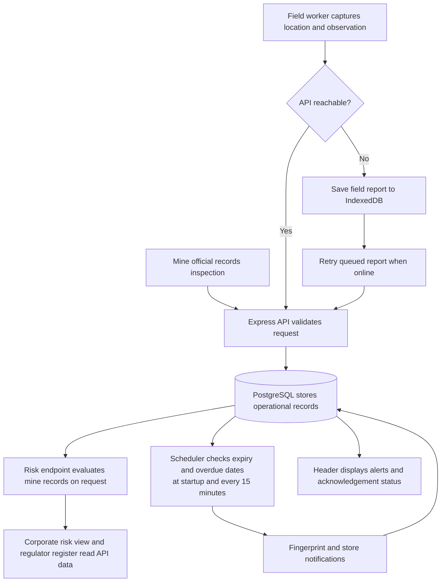

<div align="center">

# KhanRakshak

### Mine governance, compliance, and field reporting in one operational workspace

**Smart India Hackathon project | Team Debug Dynasty 404**

</div>

KhanRakshak is a prototype for bringing mine-site compliance, inspections, risk signals, and field observations into one shared workflow. It provides focused views for mine officials, corporate teams, regulators, and field workers.

> **Demo scope:** This project runs on synthetic seed data. It is not connected to live mine records, government portals, or regulator systems. The role tabs are demonstration views, not authentication or access-control boundaries.

## At A Glance

- Track statutory clearances, inspection history, and corrective actions by mine.
- Surface portfolio risk signals using rule-based checks, anomaly indicators, and trend projections.
- Review expired compliance and high-severity inspection records in a regulator-oriented ledger.
- Capture field observations with GPS, photos, and voice notes; queue reports locally while offline and sync when connectivity returns.
- Receive alerts for expired or soon-to-expire clearances and overdue corrective actions.

## Product Screens

The screenshots below were captured from the running application with the included demo data. Select a link to open the full-size screen.

| Screen | What it shows | Screenshot |
| --- | --- | --- |
| Mine Official | Mine-level compliance, corrective actions, inspection history, and inspection entry. | [Open Mine Official screenshot](frontend/public/mine-official.png) |
| Corporate | Portfolio summary and per-mine risk register. | [Open Corporate screenshot](frontend/public/corporate.png) |
| Regulator | Expired compliance and high-severity inspection register with filters. | [Open Regulator screenshot](frontend/public/regulator.png) |
| Field Report | GPS-based field capture with observation, photo, voice note, and offline queue status. | [Open Field Report screenshot](frontend/public/field-report.png) |

## System Architecture

```mermaid
flowchart TB
	subgraph Client[Browser: React and PWA]
		Screens[Role views<br/>Mine Official | Corporate | Regulator | Field Report]
		ApiClient[Fetch API client]
		ServiceWorker[Service worker<br/>caches app shell]
		Queue[IndexedDB<br/>pending field reports]
		Screens --> ApiClient
		Screens -. app assets .-> ServiceWorker
		Screens --> Queue
		Queue -. reconnect and retry .-> ApiClient
	end

	subgraph Backend[Node.js backend]
		Express[Express REST API]
		Risk[Risk calculation<br/>rules, anomaly indicator, trend]
		Scheduler[Alert scheduler<br/>startup and every 15 minutes]
		Express --> Risk
	end

	Database[(PostgreSQL<br/>mines, compliance, inspections,<br/>actions, reports, notifications)]

	ApiClient <-->|HTTP JSON| Express
	Express <--> Database
	Risk <--> Database
	Scheduler --> Database
```

During development, Vite serves the React client and Express serves the API on a separate port. The browser calls the API using HTTP and JSON. PostgreSQL is the persistent source for application records. The service worker caches the frontend shell; IndexedDB is a client-side retry queue for field reports, not a replacement for the server database.

## Operational Workflow



### Role workflows

1. **Mine Official:** Load mines, compliance, corrective actions, and inspections; choose a mine; review its status and log an inspection.
2. **Corporate:** Load portfolio totals and request a risk result for each mine. The current score uses expired and pending clearances plus high- and medium-severity inspections. Rule flags provide context for overdue actions, lapsed contractor permits, and inspection cadence; anomaly and trend indicators are returned alongside the score.
3. **Regulator:** Load compliance and inspection records; combine expired clearances and high-severity inspections into a dated register; filter the register by violation type.
4. **Field Report:** Load or reuse cached mine coordinates; capture GPS; select a report category and add an observation, photo, or voice note; submit immediately or queue in IndexedDB and retry after connectivity returns.
5. **Alerts:** Check compliance expiry and overdue open actions at backend startup and every 15 minutes; create fingerprinted notifications to avoid duplicates; let users review and acknowledge alerts.

Risk and forecast outputs are prototype decision-support signals based on the included data and code. They are not certified safety assessments or substitutes for statutory inspection and professional judgment.

## Technology

| Layer | Technologies |
| --- | --- |
| Frontend | React 18, Vite, CSS, browser service worker |
| Backend | Node.js, Express 5, PostgreSQL client (`pg`) |
| Database | PostgreSQL 16, SQL schema and demo seed scripts |
| Offline field queue | IndexedDB, browser Geolocation and MediaRecorder APIs |
| Risk signals | Rule engine, z-score anomaly indicator, linear trend projection |

## Run Locally

### Prerequisites

- Node.js 18 or newer and npm.
- Docker Desktop with Docker Compose, running before database startup.
- Git to clone the repository.

### 1. Get the code and install dependencies

```sh
git clone <repository-url>
cd khanrakshak
npm install
npm run install:all
```

`npm install` installs the root development tool; `npm run install:all` installs the backend and frontend dependencies.

### 2. Configure the backend

Create the local environment file from the example.

**Windows PowerShell**

```powershell
Copy-Item backend/.env.example backend/.env
```

**macOS or Linux**

```sh
cp backend/.env.example backend/.env
```

The example is configured for the included Docker database (`localhost:5432`). Its demo credentials are for local development only; use managed secrets and a restricted database account for any deployed environment. Do not commit `backend/.env`.

### 3. Start PostgreSQL and the app

```sh
npm run db:up
npm run dev
```

On its first start with an empty Docker volume, PostgreSQL runs the SQL files in `backend/seed` in filename order and loads the demo data. The development command starts the API and Vite client together.

- Web application: `http://localhost:5173` (Vite may choose the next free port).
- API health check: `http://localhost:4000/health`.
- API base: `http://localhost:4000/api`.

The health endpoint confirms the Express process is running. Dashboard data also requires a reachable PostgreSQL database.

### Database port conflicts

If another local PostgreSQL server is already using port `5432`, either stop that service or change the host-side port mapping in `docker-compose.yml` from `5432:5432` to `5433:5432`. Then update `DATABASE_URL` in `backend/.env` to use port `5433`. Keep the container-side port at `5432`.

### Existing database installations

Docker initialization scripts run only when the database volume is first created. For an existing project database, apply the additive upgrade script when needed:

```sh
docker compose exec -T db psql -U khanrakshak -d khanrakshak -f /docker-entrypoint-initdb.d/03_upgrade_existing_installations.sql
```

Avoid deleting the Docker database volume unless you intend to erase its local data.

### Build check

```sh
npm run build --prefix frontend
```

## Demo Dataset

The seed scripts create three subsidiaries, ten mines, twenty contractors, forty compliance records, sixty inspections, corrective actions, and field reports. Some records are deliberately expired or overdue so the risk and regulator workflows have meaningful examples. The data is synthetic and will not reflect current real-world mine status.

## API Reference

| Endpoint | Purpose |
| --- | --- |
| `GET /health` | Check that the API process is running. |
| `/api/mines` | Mine listing and mine record operations. |
| `/api/compliance` | Compliance record operations. |
| `/api/inspections` | Inspection operations, including logging an inspection. |
| `/api/corrective-actions` | Corrective action operations. |
| `GET /api/dashboard` | Portfolio summary counts. |
| `GET /api/risk/:mineId` | Mine-level score, flags, anomaly indicators, and forecast. |
| `/api/field-reports` | List and create field reports. |
| `/api/notifications` | List alerts; `PATCH /:id/read` acknowledges an alert. |
| `/api/subsidiaries`, `/api/contractors` | Registry operations. |

## Repository Layout

```text
backend/
	seed/                 PostgreSQL schema, demo data, upgrade script
	src/routes/            Express API endpoints
	src/risk/              Risk rules and trend/anomaly helpers
	src/jobs/              Scheduled alert generation
frontend/
	public/                PWA assets and product screenshots
	src/pages/             Mine, corporate, regulator, and field views
	src/api/               API client and offline report queue
docker-compose.yml       Local PostgreSQL service
```

## Team

**Team name:** Debug Dynasty 404

- Saiesh Upardekar
- Sambhav Savant
- Saisha Dessai
- Anuja Patil
- Sayyam Agrekar
- Reshab Dessai

## Important Limitations

- The current build is a hackathon prototype using synthetic records.
- External government, mine-management, and regulator integrations are not configured.
- Risk indicators are illustrative and require validation against domain-approved data and methods before operational use.
